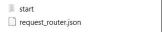
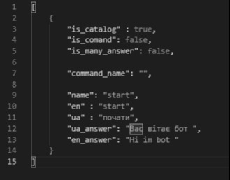
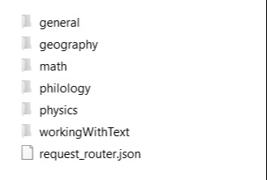
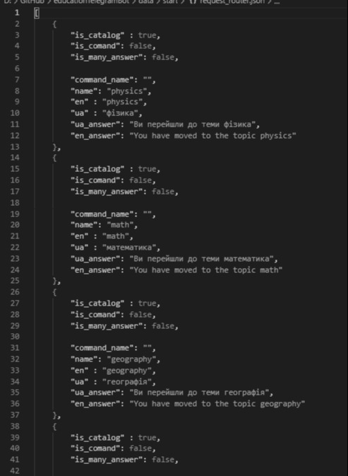
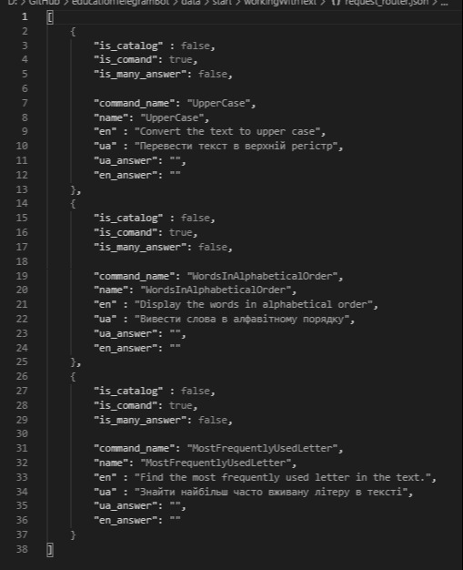
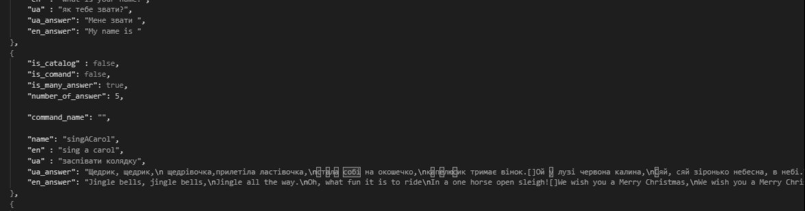
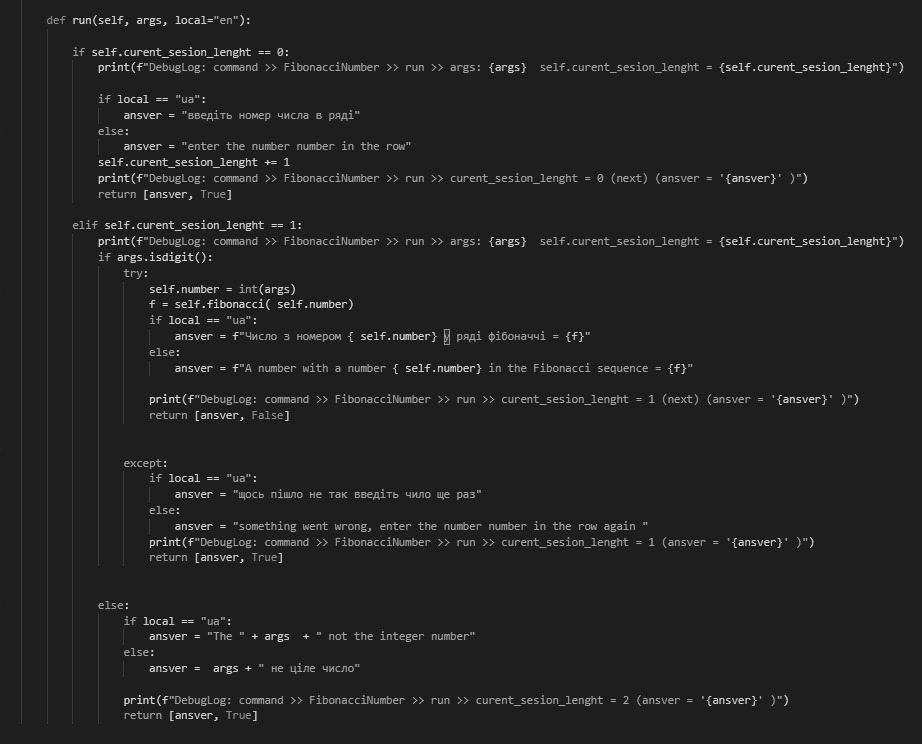
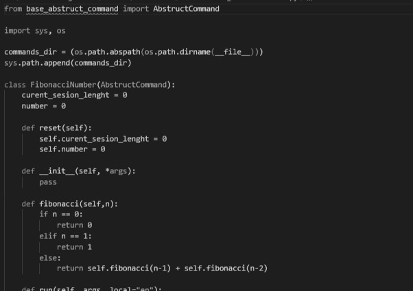
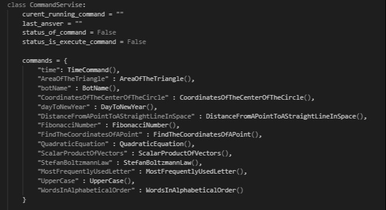

# educationTelegramBot
<!DOCTYPE html>
<!--[if lt IE 7]>      <html class="no-js lt-ie9 lt-ie8 lt-ie7"> <![endif]-->
<!--[if IE 7]>         <html class="no-js lt-ie9 lt-ie8"> <![endif]-->
<!--[if IE 8]>         <html class="no-js lt-ie9"> <![endif]-->
<html>
    <head>
        <meta charset="utf-8">
        <meta http-equiv="X-UA-Compatible" content="IE=edge">
        <title></title>
        <meta name="description" content="">
        <meta name="viewport" content="width=device-width, initial-scale=1">
        <link rel="stylesheet" href="">
    </head>
    <body>

        <!--[if lt IE 7]>
            
You are using an <strong>outdated</strong> browser. Please <a href="#">upgrade your browser</a> to improve your experience.

        <![endif]-->
        
        

        

            

                <h3 class="stiled_header">Main about bot realization</h1>

                

                    The bot written in Python is built on the basis of the architectural pattern state machine pattern, the main class of the bot is a singleton and implements basic services for working with state parameters. The cataloger in which the manager Linkmanager is currently located acts as a status indicator
                

            

            

                
to develop commands you need to develop routing in the data directory

                
for example, in order to make a theme, you need to add a folder to the theme directory

                
in addition, you need to add the path for the routing files

                <h4 style="text-align: center;">Example</h4>
                

                    
                

                
in the main folder there is a subdirectory start and a router file with the following structure

                

                    
                

                

                    
<b>is_catalog - </b>indicates whether the given route is a directory

                    
<b>is_comand - </b>indicates whether route is a command specifier

                    
<b>is_many_answer - </b>indicates whether there are multiple response options for the route

                

                <h3>Let's analyze these specifiers using examples
                </h3>
                

                    <h4>is_catalog</h4>
                    
if we need to divide some categories, for this we divide them by catalogs and enter the names of the catalogs into the route we need

                    <h3 style="text-align: center;">Example</h3>
                

                

                    
                

                

                    

                        If we use <b>is_catalog</b> then we need to specify <i>"name"</i> and statements in English and Ukrainian yes commands that lead to transition to this directory
                    

                    
But because of the features of the module that reads the Json routes, you need to specify all the parameters even if they are empty

                    
As in this example with <i>"command_name"</i> since this route is not a directory, it is not needed

                    
Here is part of the file that specifies the paths for the folders from the previous photo

                

                

                    
                

                
                

                    <h4>is_comand</h4>
                    
this tag defines that the route is a command and when the manager receives it, it will check the presence of a command defined in the command service by its name defined in this same route

                    
If we were talking about <b>is_catalog</b> for which there should not be a parameter <i>"command_name"</i> then for this tag there should be

                    <h3 style="text-align: center;">Example</h3>
                

                

                    
                

                

                    <h4>is_many_answer</h4>
                    
it is quite simple that indicates that you need to break down what is contained in the answers and choose a random one from these options by default the separator is <b>[]</b>

                    
in addition, to use this specifier, it is necessary to specify a mandatory parameter <i>"number_of_answer"</i>

                    
this means that for each route, the routing file must also have this parameter

                    <h3 style="text-align: center;">Example</h3>
                

                

                    
                

                

                    <h2>Writing commands</h2>
                    
each team implements a strategy and has an internal state

                    
each command must have at least 2 methods

                    

                        

                            <i><b>run()</b></i>
                        

                        

                            <i><b>reset()</b></i>
                        

                    

                    <h3>run</h3>
                    

                        a command that, depending on the state, performs operations and gives a response 
                        <h4>response</h4>
                        

                            
 response: list [ ansver: str, state: bool ]

                            

                                <h4>ansver</h4> - this is what the user will see after executing this state
                                <h4>state</h4> - this is a status that says whether the command is finished <b>[false]</b> or not <b>[true]</b>
                            

                        

                        <h3 style="text-align: center;">Example</h3>

                        

                            
                        

                    

                    <h3>reset</h3>
                    

                        this command updates all the states defined in the command to the base values, including the internal state
                        <h3 style="text-align: center;">Example</h3>
                        
                        

                            
                        

                    

                

                

                    <h3>
                        Implementation of the command in the service
                    </h3>
                    
in order for the command written by you to work, you need to register it in the command services

                    <h3 style="text-align: center;">Example</h3>
                    

                        
                    

                

            

            

                <h2>developed by óchiAnthropos</h2>

            

        

        
    </body>
</html>